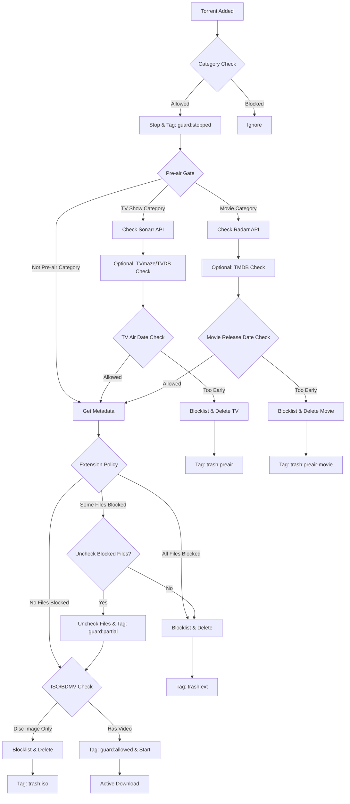

#  qbit-guard

A lightweight Python guard for qBittorrent that provides intelligent torrent management with **pre-air checking** and **ISO/BDMV cleanup**.

<div class="grid cards" markdown>

-   :material-download:{ .lg .middle } __Get Started__

    ---

    Install and configure qbit-guard in minutes

    [:octicons-arrow-right-24: Installation](usage/install.md)

-   :material-cog:{ .lg .middle } __Configuration__

    ---

    Environment-driven configuration with sensible defaults

    [:octicons-arrow-right-24: Configuration](usage/configure.md)

-   :material-code-braces:{ .lg .middle } __Examples__

    ---

    Real-world deployment scenarios and configurations

    [:octicons-arrow-right-24: Examples](examples.md)

-   :material-help-circle:{ .lg .middle } __Support__

    ---

    Troubleshooting guide and development resources

    [:octicons-arrow-right-24: Troubleshooting](troubleshooting.md)

</div>

## :sparkles: Features

!!! tip "Intelligent Torrent Management"
    qbit-guard automatically manages your torrents with smart filtering and cleanup rules.

=== "Pre-air Gate"

    **Stops new TV torrents and unreleased movies**
    
    - **TV Shows**: Checks `airDateUtc` via Sonarr with configurable grace/cap windows
    - **Movies**: Checks release dates via Radarr (digitalRelease, physicalRelease, inCinemas)
    - Supports release group / indexer / tracker whitelisting
    - Blocks too-early releases automatically
    - Integrates with Sonarr/Radarr for metadata validation

=== "ISO/BDMV Cleanup"

    **Removes disc-image-only torrents**
    
    - Detects ISO/IMG/MDF/NRG/CUE/BIN files
    - Identifies `BDMV` and `VIDEO_TS` folders
    - Preserves torrents with keepable video files
    - Configurable minimum file size thresholds

=== "Smart Blocklisting"

    **Automated blocklist management**
    
    - Blocklists in Sonarr/Radarr before deletion
    - Uses deduped history (single "grabbed" record per unique release)
    - Queue failover if history endpoint times out
    - Prevents duplicate downloads

=== "Cross-verification"

    **Optional internet verification**
    
    - TVmaze, TheTVDB, and/or TMDB integration
    - Cross-checks Sonarr air dates and movie release dates
    - TMDB provides authoritative digital/physical release dates for movies
    - Improves accuracy of pre-air filtering for both TV and movies
    - No API keys required for TVmaze

=== "qBittorrent Support"

    **Works with modern and legacy versions**
    
    - **qBittorrent 5.x** - Preferred with start/stop support
    - **qBittorrent 4.x** - Uses resume/pause fallback
    - WebUI authentication support
    - Category-based filtering

=== "Lightweight Runtime"

    **Container-friendly and lightweight**
    
    - Minimal Python runtime dependency surface
    - Environment variable configuration
    - Structured logging to stdout
    - Minimal resource usage

=== "Selective File Control"

    **Advanced file management**
    
    - Selective file unchecking instead of full torrent deletion
    - Preserves wanted files while blocking unwanted extensions
    - Configurable partial download behavior
    - Tagged torrents for easy identification (`guard:partial`)

---

## :gear: How it Works



!!! info "Flow Steps"
    1. **On add** → torrent immediately stopped and tagged `guard:stopped`
    2. **Category filter** → only `QBIT_ALLOWED_CATEGORIES` are processed  
    3. **Pre-air gate**: 
        - **TV Shows** (if Sonarr category): consult Sonarr (+ optional TVmaze/TVDB)
        - **Movies** (if Radarr category): consult Radarr for release dates (+ optional TMDB cross-check)
        - If **blocked** → blocklist in *arr, tag `trash:preair` or `trash:preair-movie`, delete torrent
        - If **allowed** → continue
    4. **Metadata fetch** → briefly start torrent to get file list, respect wait/budget limits, then stop
    5. **Extension policy** → check files against allow/block lists:
        - If **all blocked** → delete torrent (optional: tag `trash:ext`)
        - If **some blocked** → uncheck blocked files, tag `guard:partial`, continue with allowed files
        - If **none blocked** → continue
    6. **ISO/BDMV cleanup** → if disc-image-only and no keepable video, blocklist + delete (tag `trash:iso`)
    7. **Start for real** → tag `guard:allowed` and start torrent

!!! note "Keepable Video Files"
    Files with extensions: `.mkv .mp4 .m4v .avi .ts .m2ts .mov .webm` and size ≥ threshold.

---

## :hammer_and_wrench: Requirements

!!! warning "Prerequisites"
    Ensure all services are properly networked and accessible between containers.

| Component | Version | Purpose | Required |
|-----------|---------|---------|----------|
| **qBittorrent** | 5.x (4.x supported) | Torrent client | :material-check: Required |
| **Python** | 3.8+ | Script mode only | :material-minus: Optional |
| **Sonarr** | v3+ | TV pre-air checking | :material-minus: Optional |
| **Radarr** | v3+ | Movie pre-air checking & ISO blocklisting | :material-minus: Optional |
| **TMDB API** | - | Movie release date verification | :material-minus: Optional |
| **Network** | - | Service connectivity | :material-check: Required |

---

## :rocket: Quick Start

=== "Docker Compose (Recommended)"

    ```yaml
    version: '3.8'
    services:
      qbit-guard:
        image: ghcr.io/gengines/qbit-guard:latest
        container_name: qbit-guard
        restart: unless-stopped
        environment:
          - QBIT_HOST=http://qbittorrent:8080
          - QBIT_USER=admin
          - QBIT_PASS=your_password
          - QBIT_ALLOWED_CATEGORIES=tv-sonarr,radarr
          - ENABLE_PREAIR_CHECK=1
          - SONARR_URL=http://sonarr:8989
          - SONARR_APIKEY=your_api_key
          - # Pre-air checking for movies now uses ENABLE_PREAIR_CHECK (same as TV shows)
          - RADARR_URL=http://radarr:7878
          - RADARR_APIKEY=your_radarr_api_key
          - TMDB_APIKEY=your_tmdb_api_key  # Optional: for enhanced movie release date accuracy
          - ENABLE_ISO_CHECK=1
          - LOG_LEVEL=INFO
        networks: [arr-network]

    networks:
      arr-network: { driver: bridge }
    ```

=== "Docker Run"

    ```bash
    docker run -d \
      --name qbit-guard \
      --restart unless-stopped \
      --network arr-network \
      -e QBIT_HOST=http://qbittorrent:8080 \
      -e QBIT_USER=admin \
      -e QBIT_PASS=your_password \
      -e QBIT_ALLOWED_CATEGORIES=tv-sonarr,radarr \
      -e ENABLE_PREAIR_CHECK=1 \
      -e SONARR_URL=http://sonarr:8989 \
      -e SONARR_APIKEY=your_api_key \
      -e # Pre-air checking for movies now uses ENABLE_PREAIR_CHECK (same as TV shows) \
      -e RADARR_URL=http://radarr:7878 \
      -e RADARR_APIKEY=your_radarr_api_key \
      -e TMDB_APIKEY=your_tmdb_api_key \  # Optional: for enhanced movie release date accuracy
      -e ENABLE_ISO_CHECK=1 \
      -e LOG_LEVEL=INFO \
      ghcr.io/gengines/qbit-guard:latest
    ```

=== "UNRAID (Easy Setup)"

    **For UNRAID users - GUI-based configuration**

    1. **Install via Community Applications**:
        - Open UNRAID web interface
        - Navigate to **Apps** tab
        - Search for **"qbit-guard"**
        - Click **Install**

    2. **Configure through GUI**:
        - **Repository**: `ghcr.io/gengines/qbit-guard:latest`
        - **Network**: Select your Docker network
        - **Environment Variables** (configure via UNRAID template):
            - `QBIT_HOST=http://qbittorrent:8080`
            - `QBIT_PASS=your_password`
            - `SONARR_APIKEY=your_api_key` 
            - `RADARR_APIKEY=your_radarr_api_key`
            - `TMDB_APIKEY=your_tmdb_api_key` (optional)

    !!! success "UNRAID Benefits"
        User-friendly GUI configuration, automatic container management, and seamless integration with other UNRAID apps.

=== "Python Script"

    ```bash
    # Download the script
    wget https://github.com/GEngines/qbit-guard/raw/main/src/guard.py
    
    # Set environment variables
    export QBIT_HOST=http://localhost:8080
    export QBIT_USER=admin
    export QBIT_PASS=your_password
    export QBIT_ALLOWED_CATEGORIES=tv-sonarr,radarr
    export ENABLE_PREAIR_CHECK=1
    export SONARR_URL=http://localhost:8989
    export SONARR_APIKEY=your_api_key
    export # Pre-air checking for movies now uses ENABLE_PREAIR_CHECK (same as TV shows)
    export RADARR_URL=http://localhost:7878
    export RADARR_APIKEY=your_radarr_api_key
    export TMDB_APIKEY=your_tmdb_api_key  # Optional: for enhanced movie release date accuracy
    
    # Run the script
    python3 qbit_guard.py
    ```

!!! tip "Next Steps"
    After starting qbit-guard, check the logs to ensure it connects successfully to qBittorrent and any configured *arr services.

---

## :books: Documentation

- **[Installation Guide](usage/install.md)** - Detailed setup instructions
- **[Configuration Guide](usage/configure.md)** - Complete configuration options  
- **[Environment Variables](usage/env.md)** - Full variable reference
- **[Examples](examples.md)** - Real-world deployment scenarios
- **[Development](usage/dev.md)** - Development and contribution guide
- **[Troubleshooting](troubleshooting.md)** - Common issues and solutions
